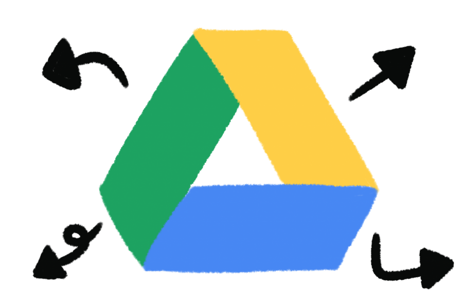

<a name="top"></a>

<div align="center">
    
    <h1>Drive to Drive Transfer</h1>
    
    <br>
    <br>
    <p>
        
        
        
    </p>
</div>

<div align="center">

&nbsp;
[](https://www.linkedin.com/in/bryan-li712/)
[](https://www.credly.com/users/bryan-li712)
[](https://github.com/Zy8712)
[](https://leetcode.com/Zy8712/)
[](https://www.frontendmentor.io/profile/Zy8712)
[](https://bryanli.vercel.app/)

</div>

> [!IMPORTANT]
> Please read and follow the instructions carefully in order to perform the Drive transfers successfully.


## Table of Contents
- [Google Drive to Google Drive.](#gdrive)
- [Mega Drive to Google Drive](#mega)


<a name="gdrive"></a>
# 📁 Copy Shared Drive Folder to My Drive — Google Apps Script

Easily copy a folder (and its contents) from a **Shared Drive** to your **Google Drive** using this simple Apps Script.

---

## ✨ Features

- 🔁 Recursively copies all files and subfolders  
- 🗂 Works with Shared Drive folders  
- 📦 Creates a new copy in your **My Drive** (or any target folder you specify)  
- 🛡 Handles errors if folder ID is invalid or inaccessible  

---

## 🚀 Getting Started

### 1. Open Google Apps Script
Go to [https://script.google.com](https://script.google.com), and start a new project.

### 2. Paste the Code

Copy the following script into the editor:

```javascript
function copyFromSharedDriveToMyDrive() {
  const fileOrFolderId = "1KcMBZ_iT9xsu9X4zC6qGJgVBhb1WduUP";  // Place the folder ID here
  const targetFolder = DriveApp.getRootFolder();  // or specify a folder in your Drive

  try {
    const folder = DriveApp.getFolderById(fileOrFolderId);
    copyFolder(folder, targetFolder);
    console.log("Folder copied successfully.");
  } catch (err) {
    console.log("Invalid ID or item not accessible. Error:", err.message);
  }
}

function copyFolder(sourceFolder, targetFolder) {
  const newFolder = targetFolder.createFolder(sourceFolder.getName());

  const files = sourceFolder.getFiles();
  while (files.hasNext()) {
    const file = files.next();
    file.makeCopy(newFolder);
  }

  const subfolders = sourceFolder.getFolders();
  while (subfolders.hasNext()) {
    const subfolder = subfolders.next();
    copyFolder(subfolder, newFolder);
  }
}
```

## 🛠 How to Use

### 1. Replace the value of `fileOrFolderId` with the folder ID from your Shared Drive.
- Example: `https://drive.google.com/drive/folders/your-folder-id`

### 2. (Optional) Change `DriveApp.getRootFolder()` to a specific folder using its ID:

```javascript
const targetFolder = DriveApp.getFolderById("your-my-drive-folder-id");
```

### 3. Save and click ▶️ `Run` > `copyFromSharedDriveToMyDrive`.

### 4. Authorize the script if prompted.


## 🧾 Notes
- Script only works if you have access to the shared folder.
- Console logs can be viewed in `View` > `Logs` after running.
- If you’re copying large folders, be patient—Google Apps Script has execution time limits.

## 📄 License
MIT — feel free to use, modify, and share!

<p align="right"><a href="#top">back to top</a></p>


<a name="mega"></a>
# ☁️ Download Public MEGA Files to Google Drive with Google Colab

This Colab notebook allows you to **download any public MEGA file link directly into your Google Drive**—no login required.

It's fast, free, and perfect for accessing large shared files using the [MEGA](https://mega.nz/) cloud platform.

---

## 🚀 Features

- ✅ No MEGA login required  
- ✅ Saves directly to your Google Drive  
- ✅ Works inside Google Colab  
- ✅ Great for large datasets or shared media  

---

## 📚 How to Use

### 1. Open in Google Colab

> [Click here to open in Colab](https://colab.research.google.com/)  
> Or upload the `.ipynb` notebook to [Google Colab](https://colab.research.google.com/)

---

### 2. Install Dependencies

```python
!pip install mega.py
```

### 3. Mount Your Google Drive

```python
from google.colab import drive
drive.mount('/content/drive')
```

### 4. Import and Initialize MEGA (No Login Needed)

```python
from mega import Mega
mega = Mega()
```

### 5. Enter a Public MEGA Link

```python
file_url = input("Enter the public MEGA file link: ")
```

### 6. Set the Google Drive Target Path

```python
target_path = '/content/drive/My Drive/'  # Default location
```

### 7. Download the File

```python
try:
    print("Downloading from MEGA...")
    file = mega.download_url(file_url, target_path)
    print(f"File successfully downloaded to Google Drive at: {file}")
except Exception as e:
    print(f"Error: {e}")
```

✅ Once downloaded, you’ll see your file inside the specified Google Drive folder.

## 📂 Example Use Case
- Download a dataset shared via MEGA
- Save educational videos or audio files for offline study
- Backup large media files directly to your cloud

## 💡 Notes
- Make sure the MEGA link is publicly shared
- Colab sessions expire after some time—ensure the download completes within that window
- You can also modify the `target_path` to save inside specific folders

## 📄 License
MIT — free to use, modify, and share.